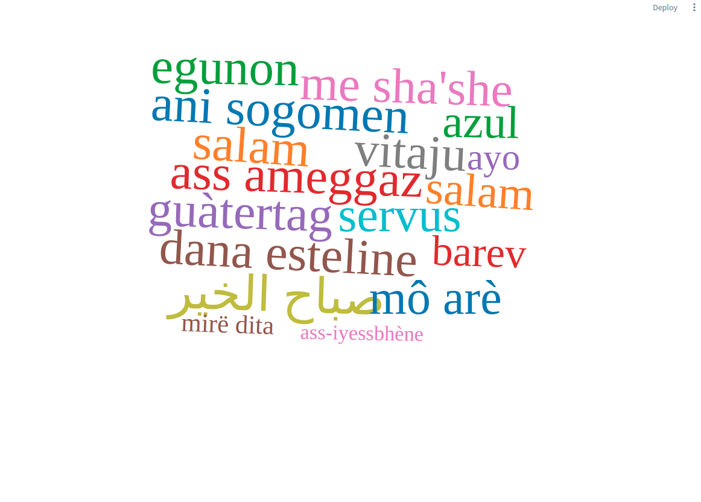

# Streamlit - WordCloud React

A Streamlit simple component to display [WordCloud](https://www.npmjs.com/package/react-d3-cloud).



## Install

```shell script
pip install st-wordcloud
```

## Usage

```python
from st_wordcloud import st_wordcloud

words = [{"text": "Python", "value": 500, "topic": "lol"}, {"text": "Streamlit", "value": 80},{"text": "Streamlit", "value": 80},{"text": "Streamlit", "value": 80},{"text": "Streamlit", "value": 80},{"text": "Streamlit", "value": 80},{"text": "Streamlit", "value": 80}]

st_wordcloud(words, width=800, height=600)


